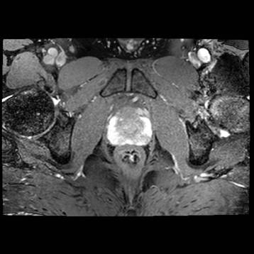

# Par0001 - elastix

###  Image data

* MR 3D, balanced steady-state free precession sequence with fat suppression
* Prostate
* Voxel size 0.49 x 0.49 x 1.0 mm,
* Dimension: 512 x 512 x 90.
* Acquired with a 3.0 T Philips MRI scanner (Gyroscan NT Intera).
* Manually cropped to a size of 271 x 333 x 86 voxels, roughly encompassing the prostate, bladder and rectum in all scans.
* Stored as in MHD format.
* Data originated from the Department of Radiotherapy, University Medical Center Utrecht, The Netherlands.

Screen shot:

###  Application

A set of 50 clinical MR scans were registered interpatiently for the final purpose of atlas-based segmentation of the prostate. In this experiment the effect of the transformation model was studied.

To this end, we used localised MI as a cost function [1], and a four-level Gaussian image pyramid with downsampling. The following transformation models were compared: translation, rigid, affine, and B-spline with different control point spacings: 64, 32, 16, 8, and 4 mm. The result of the registration with translations was only used as an initialisation for all other registrations. For the B-spline registrations, the control point grid was subjected to a multiresolution scheme: registration starts with a coarse control point resolution; with smoother versions of the images, the control point resolution is increased accordingly.

###  Registration settings

`elastix` version: 3.9

Command line call:

    elastix -f patientA.mhd -m patientB.mhd -p par0001translation.txt -p par0001.txt -out outputdir

with:  = one of {rigid, affine, bspline64, bspline32, bspline16, bspline08, bspline04}

For parameter files, see below.

###  Published in

These registration are described in the publication:

S. Klein, M. Staring, K. Murphy, M.A. Viergever, J.P.W. Pluim, "`elastix`: a toolbox for intensity based medical image registration," IEEE Transactions on Medical Imaging, vol. 29, no. 1, pp. 196-205, 2010.

###

Image data and manual segmentations have been made available via  ! See  for instructions how to log in.

###  References

[1] S. Klein, U.A. van der Heide, I.M. Lips, M. van Vulpen, M. Staring and J.P.W. Pluim, "Automatic Segmentation of the Prostate in 3D MR Images by Atlas Matching using Localised Mutual Information," Medical Physics, vol. 35, no. 4, pp. 1407 - 1417, April 2008.
