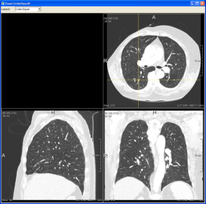

# Par0003 - elastix

###  Registration Description
interpatient; affine + B-spline transformation; mutual information	

###  Image data

* 3D chest CT
* Lung
* Full inspiration, without contrast agent, follow-up scans
* Voxel size ranging from 0.55 x 0.55 x 0.7 mm to 0.8 x 0.8 x 0.7 mm
* Dimension: 512 x 512 x [383 - 529]
* Acquired with a Philips 16-detector-row CT scanner (Mx8000 IDT or Brilliance 16P)
* All data downsampled by a factor of 2 in each dimension
* Stored as in MHD format
* Data originated from the Nelson lung cancer screening trial

Screen shot:

###  Application

The influence of the choice of multiresolution strategy is examined in this experiment.

CT chest scans of 26 patients were taken from a lung cancer screening trial [1]. Each patient had a baseline and a follow-up scan, acquired 3-9 months apart.

For each patient the baseline and follow-up scans were registered using a nonrigid B-spline transformation. An affine registration was used for initialisation. The registration was performed with a Gaussian image pyramid (without downsampling) using R in {1,ldots,8} levels. Two experiments were performed for each value of R. Firstly, the resolution of the B-spline control point grid was kept at a constant value of 12 mm (isotropic) in all resolutions. Secondly, the grid was refined after each resolution, such that at the final resolution the control points were spaced 12 mm apart again. This yields 16 experiments on 26 image pairs, resulting in a total of 416 registrations.

One hundred corresponding points in each baseline and follow-up scan were established by two independent observers using a semi-automatic algorithm [2]. The transformation mathbf{T}_{hatmu} was applied to the annotated points in the fixed image using `transformix`. To evaluate the registration accuracy, the mean distance between the resulting locations and the reference standard of the observer annotations was computed.

###  Registration settings

`elastix` version: 3.9

Here, `R` refers to the number of resolutions that was used, `fg` uses a fixed B-spline grid (no upsampling) and `ug` additionally performs multi-resolution on the B-spline transform.

Command line call:

    elastix -f baseline_p.mhd -m followup_p.mhd -p par0003.affine.txt
            -p par0003.bs-.txt -out outputdir_p

where `p` refers to the j-th patient.

###  Published in

These registration are described in the publication:

S. Klein, M. Staring, K. Murphy, M.A. Viergever, J.P.W. Pluim, "`elastix`: a toolbox for intensity based medical image registration," IEEE Transactions on Medical Imaging, vol. 29, no. 1, pp. 196-205, 2010.

### other comments

See the [elastix manual][3] for hints on how to subsequently apply the transformation to the annotated points using `transformix`.

###  References

[1] C. A. van Iersel, H. J. de Koning, and G. Draisma et al., "Risk-based selection from the general population in a screening trial: Selection criteria, recruitment and power for the Dutch-Belgian randomised lung cancer multi-slice CT screening trial (NELSON)," International Journal of Cancer, vol. 120, no. 4, pp. 868 – 874, 2007.

[2] K. Murphy, B. van Ginneken, J. P. W. Pluim, S. Klein, and M. Staring, "Semi-automatic reference standard construction for quantitative evaluation of lung CT registration," in MICCAI, ser. Lecture Notes in Computer Science, vol. 5242, 2008, pp. 1006 – 1013.

[3]: https://elastix.lumc.nl/download/elastix-5.0.1-manual.pdf
