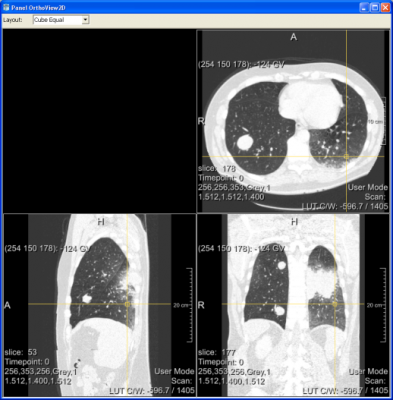

# Par0004 - elastix

###  Registration Description
intrapatient; rigid + B-spline transformation; mutual information	

###  Image data

* 3D chest CT
* Lung
* Full inspiration, without contrast agent, follow-up scans
* Voxel size around 0.7 x 0.7 x 0.7 mm
* Dimension: 512 x 512 x [400 - 550]
* Acquired with a Philips 16-detector-row CT scanner (Mx8000 IDT or Brilliance 16P)
* All data downsampled by a factor of 2 in each dimension
* Stored as in MHD format
* Data originated from the Nelson lung cancer screening trial

Screen shot:

###  Application

To investigate the effect of the rigidity penalty term, and its separate components, on image registration.

The five data sets contain 30 tumors in total at time t_0, with an average volume of 2.5 ml for the first scan t_0 and 5.1 ml for the follow-up t_1. No new tumors had developed at t_1. The CT image taken at time t_0 was set to be the fixed image. The CT image taken at time t_1 was used as the moving image. A coarse alignment between fixed and moving image was obtained by a rigid registration.

For the nonrigid registrations using the rigidity penalty term, a crude manual segmentation of the tumors was used to define the rigidity coefficient image c(mathbf{x}), setting c(mathbf{x}) to 1.0 for voxels within the tumor and to 0.0 elsewhere. Lung segmentations were used as masks for the fixed and moving image during the registration.

For evaluation of the rigidity of the tumors, precise manual segmentations of the tumors were used. Tumor volume measurements were performed to see if the registration is volume preserving, a condition for rigidity.

###  Registration settings

`elastix` version: 3.513

For results reported in Table I, II and III of the paper.

`elastix` version: 3.703

For results reported in Table IV of the paper.

With regards to the parameter files note the following:

* `NRU` refers to unconstrained nonrigid registration (no penalty terms),
* `NRP` refers to nonrigid registration with a rigidity penalty term,
* when only one of the conditions in Eq. (8) of the paper is used, the method is referred to as AC, OC, or PC
* the NRP parameter files are `base` files. The specific coefficient image needs to be added to these files for each registration separately. So you need to fill in:

    (MovingRigidityImageName "/data/patient_t_c.mhd")

Command line call:

    elastix -f baseline_p.mhd -m followup_p.mhd
            -fMask baseline_p_mask.mhd -mMask followup_p_mask.mhd
            -p par0004.rigid.txt -p par0004.bs.txt -out outputdir_p

where `p` refers to the j-th patient.

###  Published in

These registration are described in the publication:

M. Staring, S. Klein and J.P.W. Pluim, "A Rigidity Penalty Term for Nonrigid Registration," Medical Physics, vol. 34, no. 11, pp. 4098 - 4108, November 2007.

### Other comments

In `elastix 4.2` we rewrote the rigidity penalty term metric, so that it works independently from the Mattes mutual information metric. Now it is possible to combine the rigidity penalty term with any metric, not just MI. The new implementation is exactly the same as the old one. In order to use the new one you need to replace several lines in the parameter files from above.

Replace the Registration component from `MultiResolutionRegistration` to:

    (Registration "MultiMetricMultiResolutionRegistration")

Replace the Metric component from `MattesMutualInformationWithRigidityPenalty` to:

    (Metric "AdvancedMattesMutualInformation" "TransformRigidityPenalty")

Replace the `RigidityPenaltyWeight` with:

    (Metric0Weight 1.0)
    (Metric1Weight  ... )

The other parameters remain unchanged.

Starting with `elastix 4.4` the old implementation was removed.
