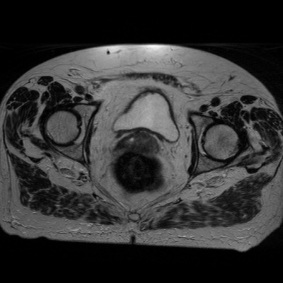

# Par0005 - elastix

###  Image data

* MR 3D, T2-weighted sequence taken in the transversal direction
* Cervix
* Voxel size 0.625 x 0.625 x 4.5 mm
* Dimension: 512 x 512 x 30.
* Acquired with a 1.5 T Philips MRI scanner (Gyroscan NT Intera).
* Manually cropped to a size of 210 x 250 x 30 voxels, roughly encompassing the relevant structures in all scans.
* Stored as in MHD format.
* Data originated from the Department of Radiotherapy, University Medical Center Utrecht, The Netherlands.
* Manual segmentations of the GTV, CTV, bladder and rectum were available for each image. They were created by a radiation oncologist and approved by a radiologist.

Screen shot:

###  Application

Nineteen patients were scanned. Each patient was scanned 5 times, one scan each week, except for two patients who were scanned 4 times. The data were divided into two sets. The first set contains the images at week 1 and 2 (19 image pairs), and is used for selection of the parameters. The second set consists of the remaining 55 images: 19 pairs of weeks 3 and 4, and 17 pairs of weeks 4 and 5; a total of 36 image pairs. The second set is used for comparing MI and α-MI with parameters tuned on the first set.

Registrations were performed to compare a multi-feature graph-based alpha-mutual information measure with a standard intensity-and-histogram-based mutual information measure.

The clinical purpose of registering these scans are in the field of radiotherapy and are multiple: to create a radiation dose targeting plan by means of atlas-based segmentation, to detect when this plan needs adaptation, and to define treatment margins. See the introduction of the paper for more details.

From the vast amount of choices, features that describe the local structure of images supply supplementary knowledge, which may improve the registration. We choose the set of Cartesian image structure features up to the second order derivatives, listed in Table I of the paper. These feature images are used as input for the alpha-mutual information metric, and are computed beforehand.

###  Registration settings

`elastix` version: 4.003

Parameter files, see below

Command line call:

    elastix -f0 patient_week_ffeature0.mhd ... -fP patient_week_ffeatureP.mhd
            -m0 patient_week_mfeature0.mhd ... -mP patient_week_mfeatureP.mhd
            -p par0005.MI.rigid.txt -p par0005.txt -out outputdir

with: P the number of features  
 = one of the parameter files above

###  Published in

These registrations are described in the publication:

M. Staring, U.A. van der Heide, S. Klein, M.A. Viergever and J.P.W. Pluim, Registration of Cervical MRI Using Multifeature Mutual Information, IEEE Transactions on Medical Imaging, vol. 28, no. 9, pp. 1412 - 1421, September 2009.

###

The features were computed outside of `elastix` and before the start of the registration. The source code of the feature computation software is made available through:

notably the tool `pxgaussianimagefilter`. The PCA analysis was performed using `pxpca`.
