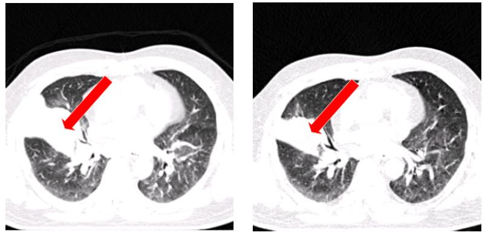

# Par0007 - elastix

###  Registration Description
intrapatient; B-spline transformation; mutual information	

###  Image data

* 4D chest CT
* Lung
* Peak inhale and peak exhale
* Voxel size resampled to 1.0 x 1.0 x 1.0 mm
* Dimension: 304 x 304 x 320
* Stored as in Analyze format

Screen shot:

Comments: The left figure is the target image which is before radiation therapy and the right one is the template image which is after radiation therapy. Red arrows indicate the tumor regions.

###  Application

Present treatment-planning dosimetry constraints for the lung are based on studies that assume lung tissue is homogeneous in its response to toxicity, irrespective of tissue location or underlying function. We compare regional pulmonary function before and after radiation therapy (RT) with planned radiation dose at different locations of the lung. In order to compare them, all the function map need to be mapped to the free breathing scan where RT is planned. A high probability exists for the tumor to have changed fundamentally in size and shape between the free breathing scan and the end expiration post RT and end inspiration post RT scans, since substantial radiation dose has been delivered and significant time has passed. To find the transformation of end expiration post RT scan to the free breathing before RT scan, the non-rigid registration with local rigidity penalty term method is applied [1]. Approximately 120 vascular bifurcation points are used as landmarks to evaluate registration accuracy. A landmark annotating system [2] is used to guide the observer to find the corresponding landmarks.

###  Registration settings

`elastix` version: 4.0

###  Published in

These registration are described in the publication:

K. Ding, J.E. Bayouth, J.M. Buatti, G.E Christensen, and J.M. Reinhardt, 4DCT-Based Measurement of Radiation Induced Changes in Pulmonary Function, submitted.

### Other comments

The authors would like to thank Ms. Keelin Murphy and Dr. Bram van Ginneken for providing the software iX for annotating landmarks, Dr. Marius Staring for his valuable advice concerning the nonrigid registration with local rigidity. This work was supported in part by NIH grant HL079406.

###  References

[1] M. Staring, S. Klein, and J. P. W. Pluim et al., "A rigidity penalty term for nonrigid registration," in Medical Physics, vol. 34, no. 11, pp. 4098 – 4108, 2007.

[2] K. Murphy, B. van Ginneken, J. P. W. Pluim, S. Klein, and M. Staring, "Semi-automatic reference standard construction for quantitative evaluation of lung CT registration," in MICCAI, ser. Lecture Notes in Computer Science, vol. 5242, 2008, pp. 1006 – 1013.
