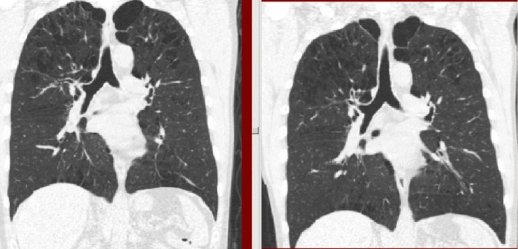

# Par0008 - elastix

###  Image data

* 3D chest CT
* Lung
* Breath-hold inspiration scans
* Voxel size resampled to 0.7x0.7x~0.7 mm
* Dimension: 512 x 512 x ~500 (sub-sampled to 256 x 256 x ~200 such that voxels were isotropic)

Screen shot:

Comments: A sample of two temporal inspiration scans from the same patient.

###  Application

Registration of follow-up inspiration CT scans has multiple applications including improving ease of visual comparison and enabling automatic comparisons. Specific medical applications are not described in this article.

###  Registration settings

`elastix` version: 4.0

###  Published in

These registration are described in the publication:

K. Murphy, B. van Ginneken, J.P.W. Pluim, S. Klein, and M. Staring, Semi-Automatic Reference Standard Construction for Quantitative Evaluation of Lung CT Registration, in MICCAI, ser. Lecture Notes in Computer Science, vol. 5242, 2008, pp. 1006 – 1013.

###  References

[1] K. Murphy, B. van Ginneken, J. P. W. Pluim, S. Klein, and M. Staring, "Semi-automatic reference standard construction for quantitative evaluation of lung CT registration," in MICCAI, ser. Lecture Notes in Computer Science, vol. 5242, 2008, pp. 1006 – 1013.
