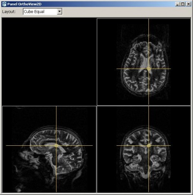

# Par0010 - elastix

###  Registration Description
interpatient; affine + B-spline transformation; mutual information	

###  Image data

* MR 3D
* Brain
* Inversion recovery 3D half-Fourier acquisition single-shot turbo spin echo sequence (HASTE), acquired in sagittal direction
* Voxel size 1.25 x 1.0 x 1.0 mm,
* Dimension: 128 x 256 x 256.
* Acquired with a Siemens 1.5T scanner.
* Corrected for non-uniformities using N3 [1].
* Stored in MHD format.
* Data originated from the Rotterdam Scan Study [2].

Screen shot:

###  Application

In this study, we use nonrigid registration to predict dementia.

###  Registration settings

`elastix` version: 4.2

Command line call:

    elastix -f image_i.mhd -m image_j.mhd -p par0010affine.txt -p par0010bspline.txt -out outputdir

###  Published in

S. Klein, M. Loog, F. van der Lijn, T. den Heijer, A. Hammers, M. de Bruijne, A. van der Lugt, R.P.W. Duin, M.M.B. Breteler and W.J. Niessen, Early diagnosis of dementia based on intersubject whole-brain dissimilarities, Proceedings of IEEE International Symposium on Biomedical Imaging: from Nano to Macro, 2010.

### Other comments

A control point spacing of 15 mm was used for the B-spline transformation (in the finest resolution).

###  References

[1] J.G. Sled, A.P. Zijdenbos, and A.C. Evans. Nonparametric method for automatic correction of intensity nonuniformity in MRI data. IEEE Trans. Med. Imaging, vol. 17, no. 1, pp. 87–97, 1998

[2] A. Hofman, M.M.B. Breteler, C.M. van Duijn, G.P. Krestin, H.A. Pols, B.H.C. Stricker, H. Tiemeier, A.G. Uitterlinden, J.R. Vingerling, and J.C.M. Witteman. The rotterdam study: objectives and design update. Eur J Epidemiol, vol. 22, no. 11, pp. 819–829, 2007.
