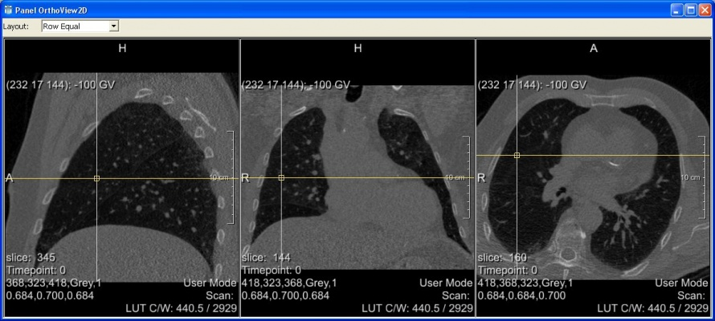
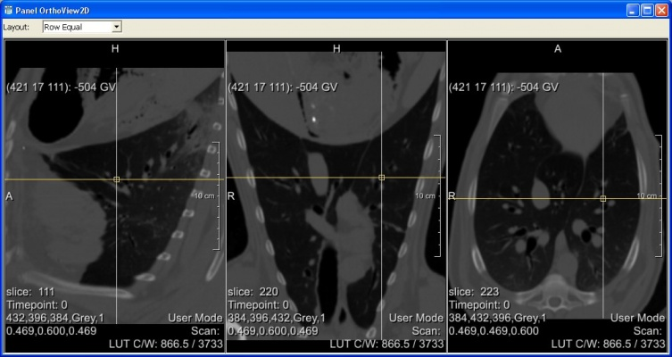

# Par0011 - elastix

###  Registration Description
intrapatient (sometimes intra-sheep); B-spline transformation; normalized correlation	

###  Image data

* 3D chest CT
* Lung
* 20 scans
* Voxel size mostly 0.7x0.7x~0.7 mm, four scans with thicker slices 1.25, 1.5, 2, 2.5 mm.
* Dimension: on average about 400 x 300 x 350

Screen shots:

###  Application

Registration of intra-patient pulmonary CT scans for the EMPIRE10 challenge at MICCAI. Sometimes sheep lungs.

For more information visit the [EMPIRE10 website][1].

The results of the challenge can be found [here][2].

###  Registration settings

`elastix` version: 4.301

Command line calls:

    elastix -f scans/x_Fixed.mhd  -m scans/x_Moving.mhd  -p parameters.Par0011.affine.txt   -out outDir1_x

    elastix -f scans/x_Fixed2.mhd -m scans/x_Moving2.mhd -p parameters.Par0011.bspline1.txt -out outDir2_x
        -t0 outDir1_x/TransformParameters.0.txt

    elastix -f scans/x_Fixed2.mhd -m scans/x_Moving2.mhd -p parameters.Par0011.bspline2.txt -out outDir3_x
        -t0 outDir2_x/TransformParameters.0.txt -fMask lungMasks/x_Fixed.mhd

where `x` refers to the patient number (01 - 20), and `Fixed2` and `Moving2` to slightly pre-processed versions of the fixed and moving image.

###  Published in

These registration are described in the publication:

Marius Staring, Stefan Klein, Johan H.C. Reiber, Wiro J. Niessen and Berend C. Stoel, Pulmonary Image Registration With `elastix` Using a Standard Intensity-Based Algorithm, EMPIRE10 workshop at MICCAI.

###  References

[1]: http://empire10.isi.uu.nl/index.php
[2]: http://empire10.isi.uu.nl/mainResults.php
