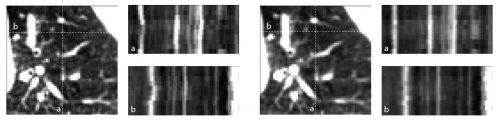
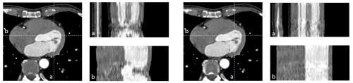
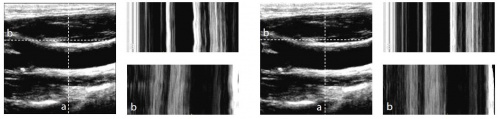
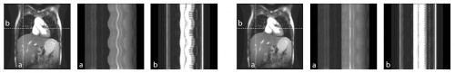

# Par0012 - elastix

###  Image data

* 4D chest CT
* 4D cardiac CTA
* 3D pediatric chest MR
* 3D carotid US

More details about the data are described in [1].

###  Application

Motion estimation from dynamical medical imaging data.

###  Results

4D chest CT: before registration (left), and after registration (right)

4D cardiac CT

3D carotid US

3D pediatric lung MR

###  Registration settings

`elastix` version: 4.305

Parameter files, see github repo.

The zip file contains all the parameter files used in [1]. The directory naming should be self-explanatory.

###  Command line calls

Two situations can be distinguished:

###  Parameter file combine script

This Python script combines the forward and inverse transformations to make a transformation relative to a chosen reference time point. Syntax:

    combine.py       [spacing=5000]

Options:

* type: determines the order in which the transforms are combined; options are:  
point: to transform points from the reference time point to all other time points  
image: to transform all time point images to the reference time point image frame
* infile0: forward TransformParameters file.
* infile1: inverse TransformParameters file.
* outfile0: respaced forward/inverse TransformParameters file.
* outfile1: combined (respaced) forward and (respaced) inverse TransformParameters file.
* ref: reference timepoint index number.
* spacing: new spacing for respaced forward/inverse TransformParameters file [default=5000].

####  Example of combining forward and inverse transformation and corresponding transformix call to transform points from reference time point 12 to other time points

    combine.py point TransformParameters.0.txt TransformParameters.1.txt Combined.0.txt Combined.1.txt 12

    transformix -tp Combined.1.txt -def  -out

Note that  contains the x, y, z coordinates of the point to transform and the t coordinate of the time point where you want to transform the points to. So given the above example with reference time point 12, you can transform point from time point 12 to time point 5 by specifying coordinates in the format x y z 5 in the .

####  Example of combining forward and inverse transformation and corresponding transformix call to align all time point images with reference time point 12

    combine.py image TransformParameters.0.txt TransformParameters.1.txt Combined.0.txt Combined.1.txt 12

    transformix -tp Combined.1.txt -in  -out

###  Known issues

The code for the 4D registration might not work correctly when the axes of the data are not equal to the coordinate system axes (direction cosines).

###  Published in

The method and experiments are published in:

[1] [Nonrigid registration of dynamic medical imaging data using nD+t B-splines and a groupwise optimization approach, C.T. Metz, S. Klein, M. Schaap, T. van Walsum and W.J. Niessen, Medical Image Analysis, in press][1]

[1]: http://dx.doi.org/10.1016/j.media.2010.10.003
