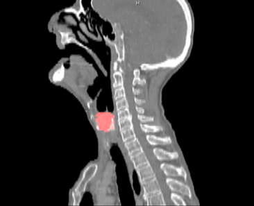
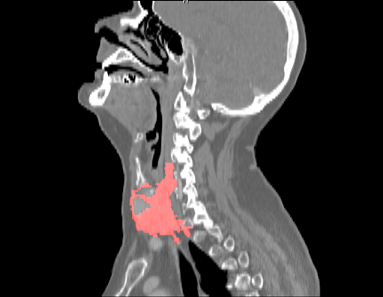

# Par0019 - elastix

###  Image data

* 3D neck CT for radiotherapy planning
* Head and neck
* 18 scans
* Spatial resolution in-plane is 1 mm (16 sets) and 0.7 mm (2 sets). Slice thickness 1.5 mm (5 sets), 2.5 mm (11 sets), 3 mm (1 sets) and 5 mm (1 sets).
* Variable longitudinal field of view

Screen shots:

 

Comments: Examples of sagittal views. The tumor is shown in red.

###  Application

Automatic atlas-based segmentation for the tissues relevant in hyperthermia treatment planning of head and neck.

###  Registration settings

`elastix` version: 4.5

Parameter files:

See Github link below

Before rigid registration images needs to be aligned due to different longitudinal field of view. Standard center of gravity and origin aligment are not always working.

###  Published in

V. Fortunati, R.F. Verhaart, F. van der Lijn, W.J. Niessen, J.F. Veenland, M.M. Paulides and T. van Walsum, Tissue segmentation of head and neck CT images for treatment planning: A multiatlas approach combined with intensity modeling, Medical Physics 40(7), 071905 (2013) [AIP][1]

[1]: http://dx.doi.org/10.1118/1.4810971
