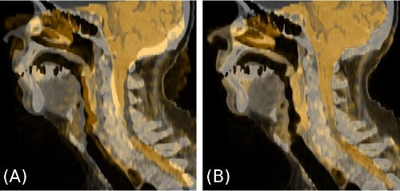

# Par0023 - elastix

###  Registration Description
intrapatient; rigid + B-spline transformation; localized mutual information combined with bending energy penalty	

###  Image data

CT and MR images of the head and neck (HN) region

* CT: 0.8 x 0.8 x 3.0 mm^3
* MR: 0.7 x 0.7 x 4.8 mm^3, T2-weighted (STIR)

Detailed information is provided in the publication listed below.

###  Application

Intra-patient deformable registration of CT and MR images of the HN region for the integration of (PET/)MRI data into radiotherapy treatment planning.

###  Registration settings

elastix version: 4.6

The deformable registration is applied after a rigid registration. The deformable registration consists of a B-spline parametrized transform and a metric combining localized mutual information with the bending energy penalty term. In our study we optimized the parameters

* number of histogram bins
* weight of the penalty term with respect to the similarity measure
* sample region size

based on eight head and neck datasets with respect to quantitative measures derived from segmentations of MR and CT.

###  Screenshots

Fusion of CT (grey) and MR (orange) images after rigid registration (A) and after deformable registration (B).

###

The deformable registration strategy was not optimized for calculation time. For the number of iterations and the number of spatial samples rather high values were chosen, which could probably be lowered if short calculation times are required.

###  Published in

S. Leibfarth , D. Mönnich, S. Welz, C. Siegel, N. Schwenzer, H. Schmidt, D. Zips, D. Thorwarth, A strategy for multimodal deformable image registration to integrate PET/MR into radiotherapy treatment planning, Acta Oncologica 52, 1353-1359 (2013)
