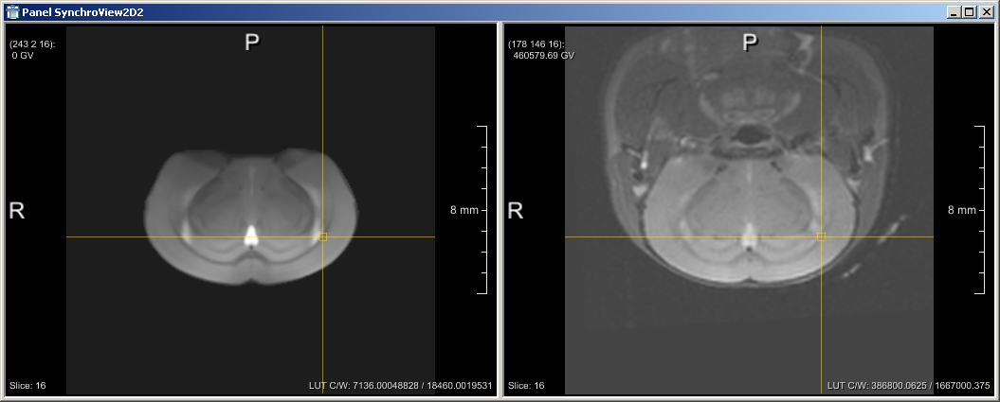

# Par0025 - elastix

###  Image data

* MR 3D multi-contrast mouse brain data
* The registration steps were carried out with the first echo (TE1) image of the MSME sequence
* T2-weighted images were acquired using a Multi Slice Multi Echo sequence (MSME; TR/TE=5,000ms/10ms; 10 echoes), DTI was recorded with an 8-shot spin echo EPI sequence (30 directions; b-value=670s/mm2, and five supplementary A0 images)
* Voxel size 0.14 x 0.14 x 0.4
* Dimension: 128 x 128 x 22
* Acquired with a Bruker Biospin (Ettlingen, Germany) 9.4T scanner
* Stored in MHD format

Screen shot:

An example of a mouse brain dataset co-registered to the template: on the left you see the used template.

###  Application

###  Registration settings

`elastix` version: 4.500

Parameter files:

See Github link below

Description:

* par0025rigid.txt the rigid registration was used to initialize the affine registration in all subjects/time-points
* par0025affine.txt the affine registration was used to initialize the non-rigid registration in all subjects/time-points

All subjects/time-points were registered to the template. So, the template was used as the fixed image. A fixed image mask was always used.

Command line call:

    elastix -f FixedImage_i.mhd -m MovingImage_j.mhd -fMask FixedImageMask_i -p par0025.txt -out outputdir

with:  = one of {rigid, affine, bspline}

###  Published in

[1] [L. Hammelrath, S. Škokić, A. Khmelinski, A. Hess, N. van der Knaap, M. Staring, B.P.F. Lelieveldt, D. Wiedermann, M. Hoehn, "Morphological maturation of the mouse brain: an _in vivo_ MRI and histology investigation," NeuroImage, 2015][1]

[1]: http://www.sciencedirect.com/science/article/pii/S1053811915009039
