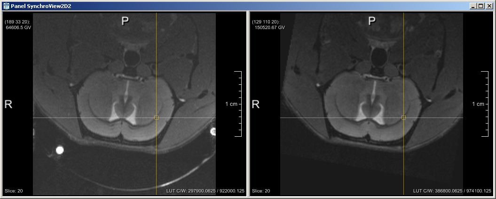

# Par0026 - elastix

###  Registration Description
intra-subject, longitudinal data; rigid + affine + B-spline transformation	

###  Image data

* MR 3D multi-contrast rat brain data
* The registration steps were carried out with the first echo (TE1) image of the MSME sequence
* T2-weighted images were acquired using a Multi Slice Multi Echo sequence (MSME; TR/TE=5,000ms/10ms; 10 echoes), DTI was recorded with an 8-shot spin echo EPI sequence (30 directions; b-value=630s/mm2, and five supplementary A0 images)
* Voxel size 0.145833 x 0.145833 x 0.5
* Dimension: 192 x 192 x 32
* Acquired with a Bruker Biospin (Ettlingen, Germany) 11.7T scanner
* Stored in MHD format

Screen shot:

An example of the co-registered rat brain data: two time-points for subject S1 are shown. On the left we see time-point 14m and on the right time-point 16m.

###  Application

###  Registration settings

`elastix` version: 4.500

Description:

* par0026rigid.txt the rigid registration was used to initialize the affine registration in all subjects
* par0026affine.txt the affine registration was used to initialize the non-rigid registration in all subjects

A fixed image mask was always used.

Command line call:

    elastix -f FixedImage_i.mhd -m MovingImage_j.mhd -fMask FixedImageMask_i -p par0026.txt -out outputdir

with:  = one of {rigid, affine, bspline}

###  Published in

[1] L. Hammelrath, A. Khmelinskii, C. Po, E. Pracht, H. Endepols, H. Backes, C. Schäfer, M. Staring, B.P.F. Lelieveldt and M. Hoehn, "," _in preparation_, 2016
