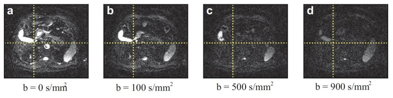

# Par0029 - elastix

###  Image data

* 3D DW-MR images
* Abdomen
* Voxel size 1.484 x 1.484 x 5 mm
* Dimension: 256 x 224 x 40
* Acquired with a 1.5 T Siemens Avanto unit
* SPAIR fat suppression
* Stored as NIfTI images (nii)
* Data originated from the QuIC-ConCePT Study [1]

Screen shot:

###  Application

For each patient, a total number of 112 three-dimensional images were acquired (b-values = {0, 50, 100, 150, 200, 300, 500, 900, 1200, 1600} s/mm2, diffusion gradients along **x**, **y** and **z**). The acquired volumes were acquired using slice interleaving, which explains why motion compensation is applied within each acquired 3D volume. Image registration is then used to bring all images to the same image space.

###  Registration settings

The parameter files are denoted using the step numbers used in the article of Guyader et al (2014), figure 3.

**Step 1** The aim of this first step is to compensate for motion withing each acquired image Ib,g,s. Two subvolumes are extracted from each acquired volume Ib,g,s,even and Ib,g,s,odd, that respectively contain only the even slices and odd slices of the original volumes (with a slice thickness multiplied by 2). In order to treat the even and odd slices equally, the two subvolumes are brought to an average mid-point space. To that purpose, Ib,g,s,even and Ib,g,s,odd are first registered to one another in both directions (i.e. in the first place with Ib,g,s,even as fixed images, and then with Ib,g,s,odd as fixed reference) using the parameter file _par0029-step1-bspline.txt_. In order Ib,g,s,even (resp. Ib,g,s,odd) to the mid-point space, the following procedure is followed: a weighted transformation (similar to par0029-step1-weightedCombination.txt]) is built, that averages the transformation found when registering Ib,g,s,odd (resp. Ib,g,s,even) to Ib,g,s,even (resp. Ib,g,s,odd). This new weighted transformation is then inverted using _par0029-step1-bspline-inversion.txt_ and applied to Ib,g,s,even (resp. Ib,g,s,even) using `transformix`.

**Step 2** For a given couple 'b-value / diffusion gradient direction', the related 4 images Jb,g,1, Jb,g,2, Jb,g,3 and Jb,g,4 are brought to the same mid-point space using a method analogous to the one used in step 1.

**Step 3** 27 pairwise registrations are performed between with /K0,0 as reference image using par0029-step3-bspline.txt.

**Step 4** The images transformations found in step 2 and 3 are concatenated to be applied on the images Jb,g,s.

`elastix` version: 4.6

###  Published in

These registrations are described in the publication:

J.-M. Guyader, L. Bernardin, N. H. M. Douglas, D. H. J. Poot, W. J. Niessen, S. Klein, Influence of image registration on apparent diffusion coefficient images computed from free-breathing diffusion MR images of the abdomen, Journal of Magnetic Resonance in Medicine, 2014

###  References

[1] J. C. Waterton, L. Pylkkanen, Qualification of imaging biomarkers for oncology drug development, European Journal of Cancer, 2012
