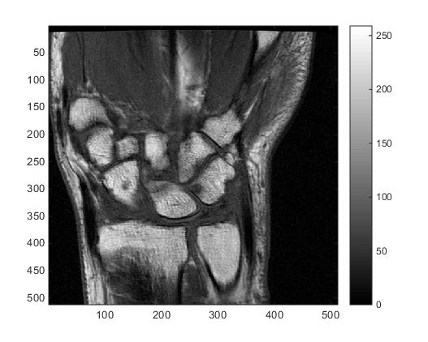
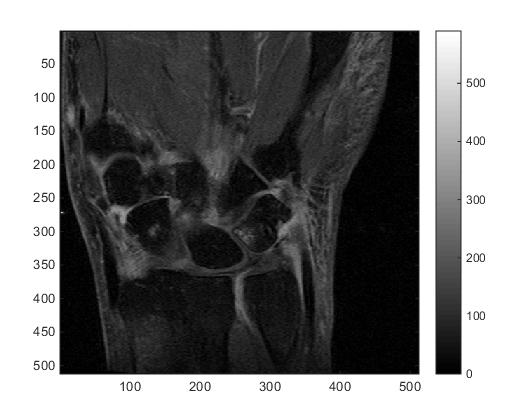

# Par0030 - elastix

###  Registration Description
inter patient; Affine + B-spline transformation; normalized cross correlation. intra patient; Rigid transformation; mutual information

###  Image data

* T1-weighted pre-contrast coronal extremity MRI of the wrist (~TE=11, TR=575)
* T1-weighted post-contrast coronal extremity MRI of the wrist (~TE=9.2, TR=700)

###  Application

Atlas-to-patient registration is required for atlas-based segmentation of the carpal bones (inter-patient, mono-modal). This is achieved in two stages, using an Affine transformation followed by a B-Spline transformation, both using Normalized Cross Correlation.

Secondly, to compare pre- and post-contrast images of the wrist, they must be registered (intra-patient, multi-modal). A rigid (Euler) transformation is used using Mutual Information.

###  Screenshots:

 

### Registration settings

### Published in

Roex - MSc thesis: Early Detection of Rheumatoid Arthritis using extremity MRI: Quantification of Bone Marrow Edema in the Carpal bones
