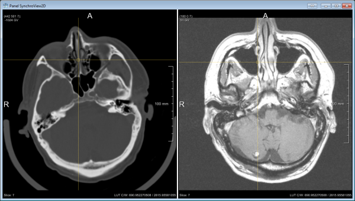
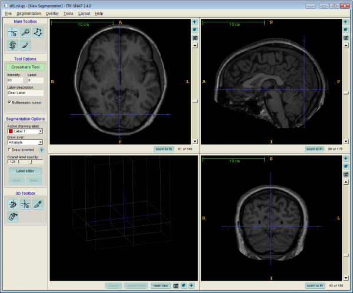

# Par0035 - elastix

###  RIRE brain data

* Multi-modality intra subject registration
* 3D CT scans with voxel size(mm) 0.45 x 0.45 x 3 and dimension is 512 x 512 x 50
* 3D T1 MR scans with voxel size(mm) 0.85 x 0.85 x 3 and dimension is 256 x 256 x 50
* 10 patients
* Ground truth: 8 corner points
* Evaluation measure: Euclidean distance

Screen shot:

An example of the fixed CT image and moving MR T1 image.

###  Registration settings

`elastix` version: 4.700

Description:

* rigid transformation using mutual information metric for different methods.

The CT image is treated as fixed image and the MR T1 image is moving image.

Command line call:

    elastix -f ct/patient<numb>.mhd -m mr/patient<numb>.mhd -p Par0035.RIRE.MI.ri.<method>.txt -out outputdir

with: <method> = one of {ASGD, ASGDPrime, FAGSD} and <numb>  = 1:10

###  SPREAD lung data

* Single modality intra subject registration
* 3D CT scans with voxel size(mm) 0.7 x 0.7 x 2.5 and dimension is 450 x 300 x 130
* 19 patients
* Metrics: mutual information, mean square distance, normalized correlation.
* Ground truth: 100 corresponding points
* Evaluation measure: Euclidean distance

Screen shot:

An example of the baseline CT scan and follow up CT scan.

###  Registration settings

`elastix` version: 4.700

Description:

* First affine transformation using different metrics for different methods.
* Second B-spline transformation using corresponding metrics for different methods.

The baseline CT scans are treated as fixed images and the following-up scans are moving images.

Command line call:

    elastix -f baseline/patient<numb>.mhd -m followup/patient<numb>.mhd -p Par0035.SPREAD.<metric>.af.0.txt -p Par0035.SPREAD.<metric>.bs.1..txt -out outputdir

with: <method> = one of {ASGD, ASGDPrime, FAGSD}

 <numb> = 1:19

 <metric> = one of {MI, MSD, NC,NMI}

###  Hammers brain data

* Single modality inter subject registration
* 3D MR scans with voxel size(mm) 0.94 x 0.94 x 0.94 and dimension is 180 x 200 x 170
* 30 images
* Metrics: mutual information
* Ground truth: 83 anatomical segmentation
* Evaluation measure: Dice overlap
* Total number of registrations: 657720

Screen shot:

An example of the Hammers brain data.

###  Registration settings

`elastix` version: 4.700

Description:

* First similarity transformation for different methods.
* Second B-spline transformation for different methods.

Each MR scan is treated as fixed image and other 29 scans are treated as moving image, so total registration per setting is 30 * 29 = 870.

Command line call:

    elastix -f patient<numb1>.mhd -m patient<numb2>.mhd -p Par0035.Hammers.MI.si.0.txt -p Par0035.Hammers.MI.bs.1.<method>.txt -out outputdir

with: <method> = one of {ASGD, ASGDPrime, FAGSD}

<numb1> != <numb2> = 1:30

###  Abdomen data

* Single modality intra subject registration
* 4D ultrasound images with voxel size(mm) 0.7 x 0.7 x 0.7 x 1 and dimension is 227 x 229 x 227 x 96
* 9 images
* Metrics: Variance Over Last Dimension
* Ground truth: 22 landmarks
* Evaluation measure: Euclidean distance

###  Registration settings

`elastix` version: 4.700

Description:

* All time point images are registered to the mean time point image, so the fixed image and moving image are the same one. The inverse registration is just for the evaluations. For different methods, just replace the line (ASGDParameterEstimationMethod "DisplacementDistribution").

Command line call:

    elastix -f patient<numb>.mhd -m patient<numb>.mhd -p Par0035.Ultrasound.MI.txt -out outputdir

 <numb> = 1:9

###  Published in

[1] Y. Qiao, B. van Lew, B.P.F. Lelieveldt and M. Staring, "Fast Automatic Step Size Estimation for Gradient Descent Optimization of Image Registration," IEEE Transactions on Medical Imaging, in press.
