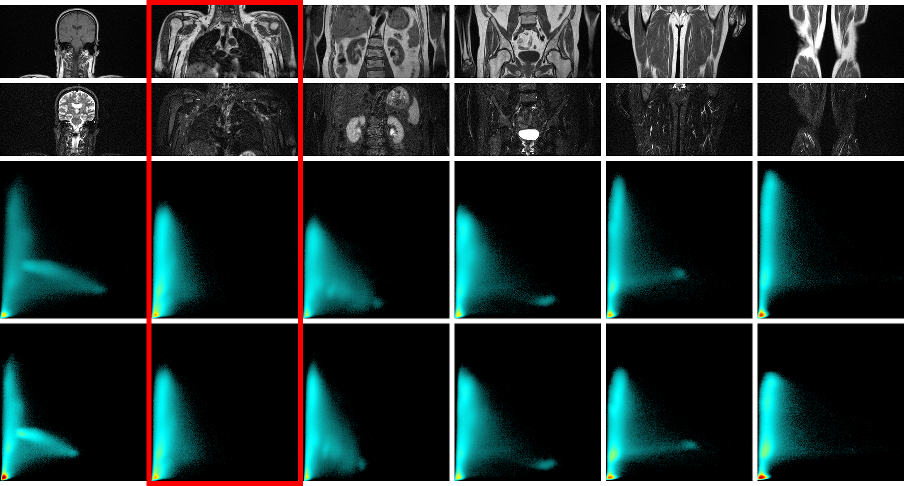

# Par0036 - elastix

###  Image data

* 2D joint intensity histograms of the multi-spectral multi-station whole-body MR data
* Stored in PNG format

###  Application

* The registration was used for bringing all the acquired stations into the same intensity space

* Columns: different stations of the same whole-body MR volume. The reference station is highlighted in red
* First row: one slice from the T1-weighted channel
* Second row: one slice from the STIR channel
* Third row: raw joint intensity histogram of each station
* Fourth row: raw joint intensity histogram of each station after registration

###  Registration settings

`elastix` version: 4.600

Parameter files:

See Github link below.

Description:

* par0036affinedti.txt the affine registration was used to register the histogram of each station to that of the reference one

Command line call:

    elastix -f FixedImage_i.mhd -m MovingImage_j.mhd -p par0036affinedti.txt -out outputdir

###  Published in

[1] [O. Dzyubachyk, M. Staring, M. Reijnierse, B.P.F. Lelieveldt, and R.J. van der Geest. "Inter-Station Intensity Standardization for Whole-Body MR Data", Magnetic Resonance in Medicine 2017;77(1):422–433.](https://www.frontiersin.org/articles/10.3389/fninf.2017.00003/full)
