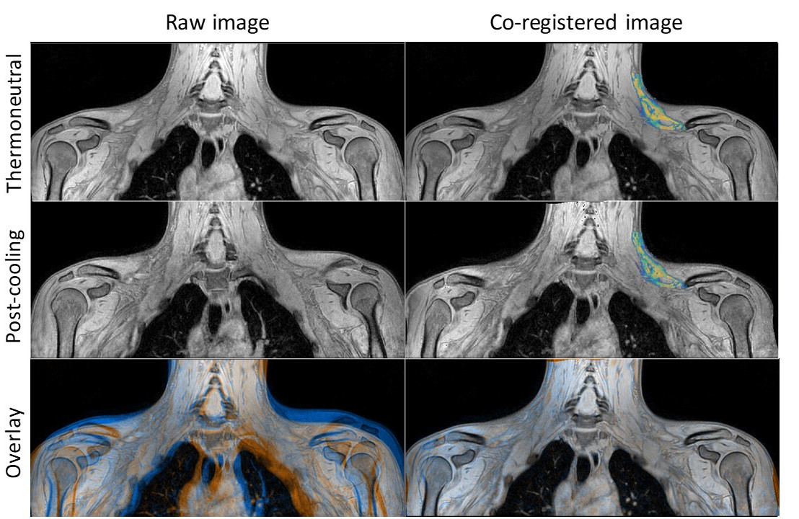

# Par0048 - elastix

###  Registration Description
intra-subject; B-spline transformation; Mattes mutual information	

###  Image data

* 3D 6-point Dixon MR volumes; pre- and post-cooling
* Stored in meta-image format

###  Application

* The registration was used for aligning pre- and post-cooling scans of the same subject

###  Registration settings

`elastix` version: 4.800

Description:

* par0048elastic.txt elastic registration was used to register the post-cooling volume to the pre-cooling one

Command line call:

    elastix -f preCooling.mhd -m postCooling.mhd -p par0048elastic.txt -out outputdir

###  Submitted manuscript

[1] G. Abreu-Vieira*, J. Burakiewicz*, L.G.M. Janssen, K.J. Nahon, M.R. Boon, O. Dzyubachyk, A.G. Webb, H.E. Kan, P.C.N. Rensen. "Human brown adipose tissue lipid mapping by MRI and its heterogenic changes in volume, mass and energy content after cold exposure"
