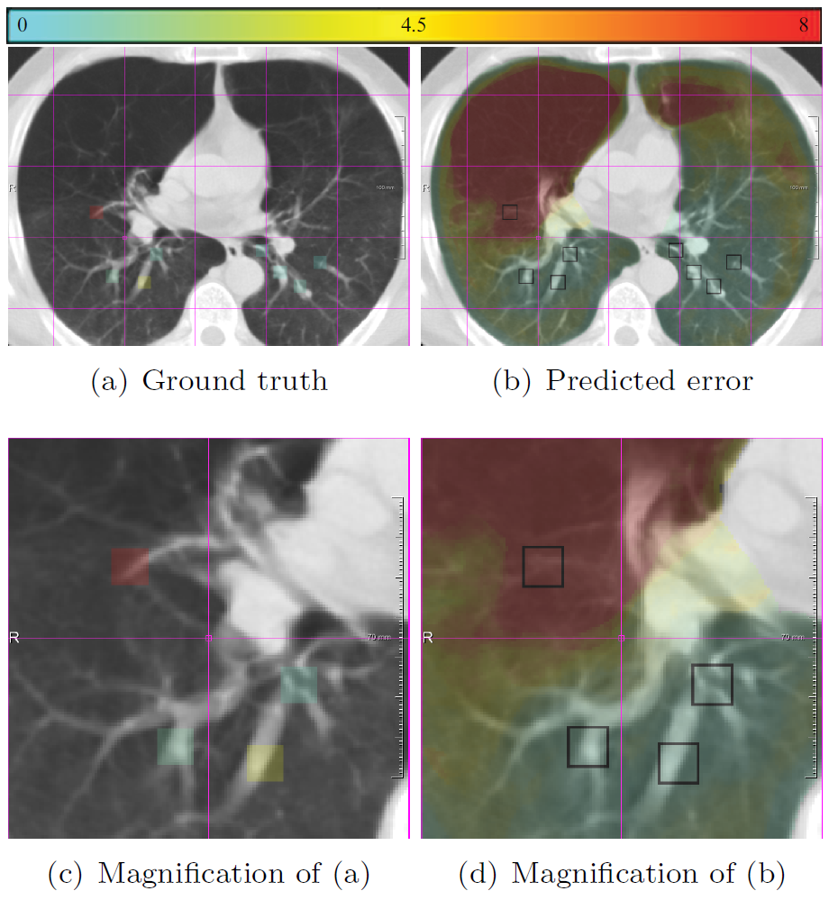

# Par0049 - elastix

###  Registration Description
intra-subject; B-spline transformation; Mattes mutual information

###  Image data

* 3D chest CT
* Applied to SPREAD (21 pairs), DIR-Lab 4DCT1 to 4DCT5 (50 pairs), DIR-Lab-COPDgene (10 pairs)
* Voxel size SPREAD 0.78x0.78x2.5 mm; DIR-Lab-4DCT 1.10x1.10x2.5 mm; DIR-Lab-COPDgene 0.64x0.64x2.5 mm

###  Application

* The method [1] used multiple registrations to predict the registration error in a quantitative manner, which can be used in any registration paradigm and can already be used for pairwise registration as well as group-wise registration
* Example data from the SPREAD dataset. The left column (a,c) shows the fixed image with the ground truth registration error overlaid in color. The square boxes around each landmark are given the same error as the error at the landmark. The right column (b,d) shows the moving image after registration with the registration error predicted by the proposed method [1] overlaid in color. (c) and (d) are zoomed in versions of (a) and (b)

###  Registration settings

`elastix` version: 4.700

Description:

* par0049_stdT2000itr.txt to calculate stdT
* par0049_stdTL.txt to calculate stdTL
* par0049_stdT-advanced.txt to calculate stdT using elastix-advanced setting
* par0049_stdTL-advanced.txt to calculate stdTL using elastix-advanced setting

###  Reference

[1] Sokooti, H., Saygili, G., Glocker, B., Lelieveldt, B.P. and Staring, M., 2016, October. Accuracy Estimation for Medical Image Registration Using Regression Forests. In International Conference on Medical Image Computing and Computer-Assisted Intervention (pp. 107-115). Springer International Publishing.
