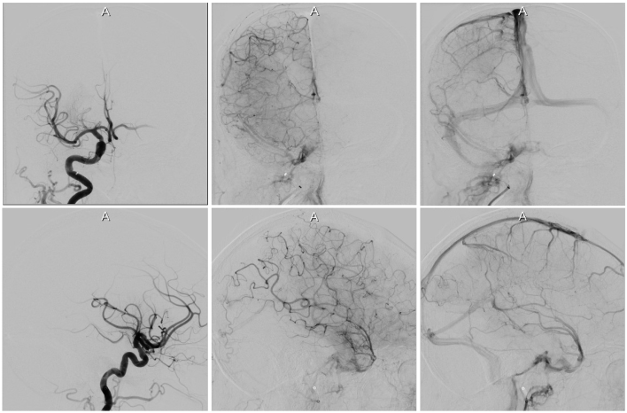

# The title of the project.
autoTICI: Automatic Brain Tissue Reperfusion Scoring on 2D DSA Images of Acute Ischemic Stroke Patients
### Note the three hashtags paragraph captions

###  Registration Description
"inter/intra-patient; affine transformation; mutual information"

###  Image data

 * Cerebral Digital Subtraction Angiography (DSA): 2D X-Ray image sequence with dimension: 1024 x 1024 x sequence length

Screen shot:

Examples of DSA images.

###  Application

The registration was used to align frames of an acquired DSA sequence, align the minIP images before and after endovascular treatment (EVT) and align the minIP images across patients. With this registration, motion artifacts caused by patient motion could be mitigated. Intra- and inter- patient DSA could be registered, which is useful for mapping annotated regions on atlas/templates onto specific patients. This registration is part of a pipeline for automatical brain tissue reperfusion scoring algorithm.

Screen shot:

An example of DSA sequence motion correction using simple elastix.

###  Registration settings

`Elastix` version: v2.0rc1 (Simple Elastix)

Command line call:
    elastixImageFilter = sitk.ElastixImageFilter()
    elastixImageFilter.SetFixedImage(fixed_image)
    elastixImageFilter.SetMovingImage(moving_image)
    parameterMap = elatixImageFilter.ReadParameterFile('Par0062.txt')
    elastixImageFilter.SetParameterMap(parameterMap)
    elastixImageFilter.Execute()
    aligned_img = elastixImageFilter.GetResultImage()

###  Published in

Su et al. (2020) autoTICI: Automatic Brain Tissue Reperfusion Scoring on 2D DSA Images of Acute Ischemic Stroke Patients (submitted)
