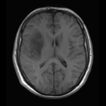
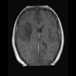
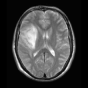
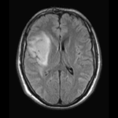

# Registration parameters for the Erasmus Glioma Database

### Registration Description

interpatient; affine transform; mutual information

### Image data

* 3D MRI data: pre-contrast T1-weighted, post-contrast T1-weighted, T2-weighted and T2-weighted FLAIR
* Brain scans of patients with glioma
* Transform tumour segmentations based on scan registration
* Registration to the [ICBM 152 2009a Nonlinear Symmetric atlas](https://www.bic.mni.mcgill.ca/ServicesAtlases/ICBM152NLin2009)
* Varying voxel size and dimensions, data obtained from clinical practice

### Application

These parameters have been used to register the patients of the [Erasmus Glioma Database](https://xnat.bmia.nl/data/archive/projects/egd) to the [ICBM 152 2009a Nonlinear Symmetric atlas](https://www.bic.mni.mcgill.ca/ServicesAtlases/ICBM152NLin2009). The Erasmus Glioma Database contains a total of 774 patients with data collected from clinical routine.
Pre-contrast T1-weighted and post-contrast T1-weighted scans are registered to the T1-weighted atlas. T2-weighted and T2-weighted FLAIR scans are registered to the T2-weighted atlas.

Screen shots:



From left to right: Pre-contrast T1-weighted scan, post-contrast T1-weighted scan, T2-weighted scan and T2-weighed FLAIR scan.
These scans are from patient EGD-0393.

### Registration settings

`Elastix` version:  5.0.0

Description: Parameter file `Par0064_rigid.txt` contains the parameters for the rigid registration, parameter file `Par0064_affine.txt` contains the parameters for the affine registration

Command line call:

```bash
# Register scan to atlas
# Replace SCAN.nii.gz by the scan file, and ATLAS.nii.gz by the appropriate atlas file (either the T1 or T2 atlas)
elastix -f ATLAS.nii.gz -m SCAN.nii.gz -p Par0064_rigid.txt -p Par0064_rigid.txt
# Transform scan to atlas
transformix -in SCAN.nii.gz -tp TransformParameters.1.txt

# Transforming masks requires setting BSpline order to 0
sed -i 's/(FinalBSplineInterpolationOrder 3)/(FinalBSplineInterpolationOrder 0)/g' TransformParameters.0.txt
sed -i 's/(FinalBSplineInterpolationOrder 3)/(FinalBSplineInterpolationOrder 0)/g' TransformParameters.1.txt

# Replace MASK.nii.gz with the appropriate mask file
transformix -in MASK.nii.gz -tp TransformParameters.1.txt
```

### Published in

Paper to be published, reference will be added at a later time.

### References

ICBM 152 Atlas:

VS Fonov, AC Evans, K Botteron, CR Almli, RC McKinstry, DL Collins and BDCG, Unbiased average age-appropriate atlases for pediatric studies, NeuroImage,Volume 54, Issue 1, January 2011, ISSN 1053–8119, DOI: 10.1016/j.neuroimage.2010.07.033

VS Fonov, AC Evans, RC McKinstry, CR Almli and DL Collins, Unbiased nonlinear average age-appropriate brain templates from birth to adulthood, NeuroImage, Volume 47, Supplement 1, July 2009, Page S102 Organization for Human Brain Mapping 2009 Annual Meeting, DOI: 10.1016/S1053-8119(09)70884-5
