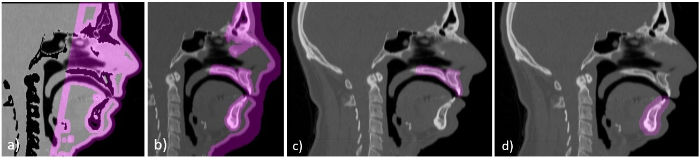

Registration Description

# **Image data**
- 3D CT scan head/neck
- 24 CT scans

*Figure 1: Sagittal sections of the reference CT scan with binary masks (pink)*

# **Application**
Realignment of CT images of the human face for the generation of patient-specific Finite Element (FE) models in orthognathic surgery.

# **Registration settings**
This paragraph is required. The link to GitHub is automatically inserted after this caption.

Elastix version: 5.1.0

# **Description**
The aim of this project is to generate customised 3D finite element models from a reference model built on the basis of a CT scan.
To obtain patient-specific models, the reference FE mesh is deformed to fit their anatomy.
The transformation to be applied to the reference 3D model is determined by matching CT images from the reference scanner and the patients' scanners, combining rigid and then non-rigid transformations.

#### **Challenges in image registration:**
- CT scans of patients who are candidates for orthognathic surgery often contain artefacts related to dental appliances. These artefacts complicate image registration. 
- Another challenge arises when deforming a 3D volumetric model: directly applying the 3D displacement field obtained through registration can cause excessive deformation of the model, resulting in highly distorted elements in the patient's finite element mesh, which would compromise any subsequent numerical simulation.

To overcome these difficulties, several successive registrations are performed to generate the bone structures and soft tissues separately, using masks targeting the areas of interest.
For soft tissue, two registrations are performed:
- a more flexible ‘approximate’ registration, which captures large overall deformations;
- a ‘precise’ registration, which provides reliable information on the position of tissues at the interfaces with air and bone structures.

#### **The command lines are interpreted as follows:**
- the first two generate the 3D displacement fields for the bone structures (maxilla and mandible);
- the third produces the ‘approximate’ 3D displacement field for the soft tissues;
- the fourth calculates the ‘precise’ 3D displacement field for the soft tissues, focusing on the interfaces with external elements, in particular air and bone.

#### **Command line call:**
- **maxillary bone:** elastix.exe reference_image.mhd -m patient_image.mhd -out output_directory/ -p parameters/Par.rigid.txt -fMask maxilla_mask_reference.mhd -fp reference_landmarks_maxilla.txt -mp patient_landmarks_maxilla.txt -p parameters/Par.nonRigid_os.txt (mask fig. 1c)
- **mandibular bone:** elastix.exe reference_image.mhd -m patient_image.mhd -out output_directory/ -p parameters/Par.rigid.txt -fMask mandible_mask_reference.mhd -fp reference_landmarks_mandible.txt -mp patient_landmarks_mandible.txt -p parameters/Par.nonRigid_os.txt (mask fig. 1d)
- **Approximate soft tissues:** elastix.exe -f reference_image.mhd -m patient_image.mhd -out output_directory/ -p parameters/Par.rigid.txt -fMask mask_soft_tissues.mhd -fp reference_landmarks.txt -mp patient_landmarks.txt -p parameters/Par.nonRigid_soft_tissues_EF.txt (mask fig. 1b)
- **Precise soft tissues:** elastix.exe -f reference_image.mhd -m patient_image.mhd -out output_directory/ -p parameters/Par.rigid.txt -fMask mask_soft_tissues.mhd -fp reference_landmarks.txt -mp patient_landmarks.txt -p parameters/Par.nonRigid_soft_tissues_true.txt (mask fig. 1a)

#+\s*[Pp]ublish
M.-C. Picard, M. A. Nazari, P. Perrier, et al., “ A Clinically Compatible Method for Generating Preoperative Finite Element Models to Simulate Facial Appearance and Movements in Orthognathic Surgery,” International Journal for Numerical Methods in Biomedical Engineering 42, no. 2 (2026): e70144, https://doi.org/10.1002/cnm.70144
